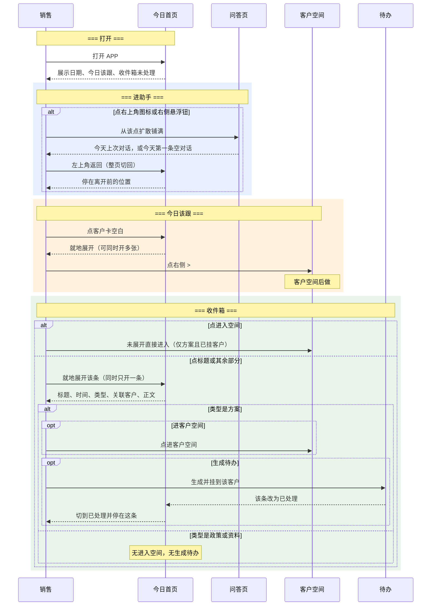

# 销售 APP · 今日首页

- 版本：v0.1
- 日期：2026-08-20
- 状态：主路径已定版；今日该跟策略、客户空间、待办总入口后做
- 范围：打开 APP 后的第一屏，以及从本页进入问答页、客户空间、收件箱展开的交互

---

## 1. 涉及主体

| 主体          | 类型      | 职责                                                         | 场景角色             |
| ------------- | --------- | ------------------------------------------------------------ | -------------------- |
| 一线销售      | 人        | 每天打开 APP，看今天该跟谁，收取后端推来的方案/政策/资料，需要时进助手问答 | 本页唯一使用者       |
| 销售 APP      | 系统      | 展示今日该跟、收件箱，承接助手入口，把方案待办挂到对应客户   | 日常主场             |
| 后端方案/运营 | 人 / 系统 | 向销售推送方案、政策、产品资料                               | 收件箱内容来源       |
| 问答助手      | 系统      | 从本页两个入口进入，对着全部工作对话                         | 从本页离开后的下一页 |

**边界**：本页只解决「打开后先看什么、推送怎么收、助手怎么进」。不在本页设计今日该跟的进池与反馈策略，不设计客户空间内部，不定待办的统一存放入口。飞书侧销售能力先停；电脑上的销售工作台仍可看，不主推。

---

## 2. 用户故事

**同步频率**：今日该跟名单按日更新（具体进池规则后做）。收件箱随后端推送到达。问答按自然日切到「今天」，同一天可新建多条对话。

**时间窗口示例**：销售早上看「8月20日 · 今日 5 人」，先扫今日该跟，再处理未读方案；下午点开一条方案生成待办后，列表切到已处理。

| 编号       | 故事                     | 角色 | 优先级 |
| ---------- | ------------------------ | ---- | ------ |
| US-HOME-01 | 打开就知道今天该跟谁     | 销售 | P0     |
| US-HOME-02 | 从顶层进入工作对话       | 销售 | P0     |
| US-HOME-03 | 收取并展开后端推送       | 销售 | P0     |
| US-HOME-04 | 方案可进客户、可生成待办 | 销售 | P0     |
| US-HOME-05 | 政策和资料只看全文       | 销售 | P0     |
| US-HOME-06 | 已读和已处理分开         | 销售 | P0     |

**US-HOME-01：打开就知道今天该跟谁**

> 作为销售，我希望打开 APP 第一眼看到今天最该跟的一小撮人。

> **关键点一**：只展示「今天该跟」这一组，大约 5 人。不够 5 个有几条示几条。

> **关键点二**：界面不出现「焦点池」，不出现规则名。卡片上只用销售能懂的理由和下一步。

> **关键点三**：进池、排序、离开名单、对推荐的反馈，后做。本页先占位和卡片骨架。

**US-HOME-02：从顶层进入工作对话**

> 作为销售，我希望助手入口始终在顶层，不挡住今日名单。

> **关键点一**：右上角动态小图标和右侧悬浮钮进同一个问答页。

> **关键点二**：首页不放输入框。

> **关键点三**：进场从被点的图标或按钮扩散铺满；返回用整页切换，回到离开前的位置。

**US-HOME-03：收取并展开后端推送**

> 作为销售，我希望有一个收件箱存放后端推进来的信息，并能就地看完全文。

> **关键点一**：收件箱在今日该跟下面，往下刷。

> **关键点二**：每条先露出标题、时间、已读/未读。

> **关键点三**：点标题或条的其余部分，这条就地往下撑开；同时只能开一条。

**US-HOME-04：方案可进客户、可生成待办**

> 作为销售，我希望方案推送能进对应客户空间，看过全文后能生成待办。

> **关键点一**：未展开时，条上方有「进入空间 >」，点了直接进该客户空间。

> **关键点二**：没看全文不能生成待办。展开后才出现「进客户空间」「生成待办」。

> **关键点三**：待办挂在对应客户上。统一存放入口后定。

**US-HOME-05：政策和资料只看全文**

> 作为销售，我希望政策和产品资料更新也能收进来，但不强行挂客户。

> **关键点一**：政策和资料本来不挂客户。

> **关键点二**：没有「进入空间 >」，不能生成待办，只看全文。

**US-HOME-06：已读和已处理分开**

> 作为销售，我希望看过和办完不是一回事，办完的还能回看。

> **关键点一**：展开过 = 已读，未读点消失，仍留在未处理。

> **关键点二**：点过生成待办 = 已处理。

> **关键点三**：未处理 / 已处理是收件箱顶上两个切换。生成待办后这条变状态，并跳到已处理。

---

## 3. 全流程时序图

---

## 4. 过程

### 4.1 打开今日首页

触发条件：销售登录后进入 APP，或从其他 Tab 回到「今日」。

参与角色：销售、今日首页。

流程：

1. 进入「今日」。
2. 顶栏左侧展示当天日期和「今日 N 人」，N 为今日该跟人数。
3. 顶栏右侧展示动态小图标。
4. 右侧展示悬浮钮。
5. 主视线上展示今日该跟，下展示收件箱，默认停在收件箱「未处理」。
6. 首页不出现输入框。

结果：销售能同时看到今天该跟的人和未处理推送，并能从两个入口进问答。

边界条件：

| 场景               | 处理                                             |
| ------------------ | ------------------------------------------------ |
| 今日该跟一个都没有 | 该区域空态，提示去客户页找人或问助手；人数为 0   |
| 收件箱未处理为空   | 未处理为空态；已处理仍可切换回看                 |
| 从问答页返回       | 整页切回，停在离开前的滚动位置                   |
| 从客户空间返回     | 回到今日；若是从某条推送离开，仍停在该条所在列表 |

UI 区域设计：

| 页面     | 区域   | 内容                                  |
| -------- | ------ | ------------------------------------- |
| 今日首页 | 顶栏左 | 日期 + 「今日 N 人」                  |
| 今日首页 | 顶栏右 | 动态小图标，点进问答页                |
| 今日首页 | 右侧   | 悬浮钮，点进同一个问答页              |
| 今日首页 | 上半   | 今日该跟                              |
| 今日首页 | 下半   | 收件箱（顶上未处理 / 已处理）         |
| 今日首页 | 底栏   | 今日 / 客户 / 相关 / 我的，当前在今日 |

### 4.2 今日该跟（骨架）

触发条件：首页加载，或销售点开/收起某张客户卡。

参与角色：销售、今日首页。

流程：

1. 只展示「今天该跟」这一组，大约 5 人，不分组。
2. 每张卡收起时露出：客户名、一句为何今天跟、系统根据理由生成的下一步、右侧 `>`。
3. 点卡片空白处，该卡就地展开；可同时展开多张。
4. 不论收起还是展开，点 `>` 进入该客户空间。
5. 卡上不提供「生成待办」。

结果：销售看懂今天为什么跟这个人、下一步是什么，并能进客户空间。

边界条件：

| 场景                   | 处理                                         |
| ---------------------- | -------------------------------------------- |
| 不足 5 人              | 有几条示几条                                 |
| 一个都没有             | 空态，不出现假数据                           |
| 展开后的详细块         | 后做，由后续清单补                           |
| 销售要对这条推荐做反馈 | 后做；反馈以后会变成一种待办，本页先不做按钮 |

规则：

| 优先级 | 判定       | 结果                                                   |
| ------ | ---------- | ------------------------------------------------------ |
| 1      | 点 `>`     | 进客户空间                                             |
| 2      | 点卡片空白 | 展开或收起该卡                                         |
| 3      | 策略未定   | 人可以先按现有「今天该跟」结果占位，文案和反馈以后替换 |

数据描述：

| 数据项       | 字段       | 说明                                     |
| ------------ | ---------- | ---------------------------------------- |
| 今日该跟列表 | 客户       | 今天被推荐跟进的客户                     |
| 今日该跟列表 | 为何今天跟 | 一句人话理由，不展示内部规则名           |
| 今日该跟列表 | 下一步     | 系统根据理由生成的一句，销售不能在卡上改 |
| 今日该跟列表 | 展开内容   | 后补                                     |

UI 区域设计：

| 区域       | 条件     | 内容                                   |
| ---------- | -------- | -------------------------------------- |
| 客户卡收起 | 默认     | 客户名、为何今天跟、下一步、右侧 `>`   |
| 客户卡展开 | 点空白后 | 仍显示收起信息；更多块后补；无生成待办 |
| 空态       | 0 人     | 去客户页或问助手的提示                 |

### 4.3 收件箱列表

触发条件：首页加载，或销售在未处理 / 已处理之间切换。

参与角色：销售、今日首页。

流程：

1. 收件箱顶上是「未处理」「已处理」两个切换，默认未处理。
2. 每条默认露出：标题、时间、已读/未读。
3. 类型为方案且已挂客户时，条的上方另有小热区「进入空间 >」。
4. 点「进入空间 >」，不展开，直接进该客户空间。
5. 点标题或条的其余部分，该条就地往下撑开；若已有另一条展开，先收起那一条。
6. 展开过即已读，未读点消失；人仍留在未处理。

结果：销售能扫推送、区分新消息，并能不看全文就进客户，或就地看全文。

边界条件：

| 场景         | 处理                                         |
| ------------ | -------------------------------------------- |
| 政策或资料   | 不出现「进入空间 >」                         |
| 方案未挂客户 | 不出现「进入空间 >」（当前约定方案才挂客户） |
| 同时展开     | 收件箱只允许一条展开                         |
| 未处理为空   | 空态；可切到已处理                           |
| 已处理为空   | 空态                                         |

规则：

| 优先级 | 判定               | 结果                         |
| ------ | ------------------ | ---------------------------- |
| 1      | 点「进入空间 >」   | 进客户空间，不改变已处理状态 |
| 2      | 点标题或其余部分   | 展开或收起该条，记为已读     |
| 3      | 只展开、不生成待办 | 仍在未处理                   |

数据描述：

| 数据项 | 字段     | 说明               |
| ------ | -------- | ------------------ |
| 推送   | 标题     | 列表主文案         |
| 推送   | 时间     | 推送到达时间       |
| 推送   | 已读     | 是否展开过         |
| 推送   | 已处理   | 是否已生成待办     |
| 推送   | 类型     | 方案 / 政策 / 资料 |
| 推送   | 关联客户 | 仅方案可有         |

UI 区域设计：

| 区域     | 条件           | 内容                 |
| -------- | -------------- | -------------------- |
| 收件箱顶 | 始终           | 未处理 / 已处理      |
| 推送条   | 默认           | 标题、时间、已读点   |
| 进入空间 | 方案且已挂客户 | 条上方「进入空间 >」 |
| 进入空间 | 政策、资料     | 不展示               |

### 4.4 收件箱展开与生成待办

触发条件：销售展开一条推送，或在展开态点「生成待办」。

参与角色：销售、今日首页、待办、客户空间。

流程：

1. 展开后固定露出：标题、时间、类型、关联客户、正文。
2. 类型为方案时，另露出「进客户空间」「生成待办」。
3. 类型为政策或资料时，只看全文，无上述两个按钮。
4. 点「进客户空间」进入该客户空间。
5. 点「生成待办」：生成一条待办并挂到该客户；本条改为已处理；列表切到已处理并停在这条。

结果：看过的还在未处理；办完的集中在已处理，且待办已挂在客户上。

边界条件：

| 场景                 | 处理                                                 |
| -------------------- | ---------------------------------------------------- |
| 未展开就想生成待办   | 不允许，界面无此按钮                                 |
| 政策/资料            | 不能生成待办                                         |
| 待办统一入口尚未确定 | 生成后只保证挂在客户上；从哪看全部待办后定           |
| 重复点生成待办       | 后补；当前按一条推送只生成一次理解，按钮变为已处理态 |

规则：

| 优先级 | 判定             | 结果                     |
| ------ | ---------------- | ------------------------ |
| 1      | 未展开           | 不能生成待办             |
| 2      | 政策或资料       | 不能生成待办，不能进客户 |
| 3      | 方案且点生成待办 | 挂到该客户，本条去已处理 |

数据描述：

| 数据项   | 字段     | 说明                         |
| -------- | -------- | ---------------------------- |
| 展开正文 | 正文     | 推送全文                     |
| 待办     | 来源推送 | 由哪一条生成                 |
| 待办     | 所属客户 | 必须挂在对应客户             |
| 待办     | 标题     | 可先用方案标题，编辑规则后定 |

UI 区域设计：

| 区域       | 条件       | 内容                             |
| ---------- | ---------- | -------------------------------- |
| 展开区     | 所有类型   | 标题、时间、类型、关联客户、正文 |
| 展开区按钮 | 方案       | 进客户空间、生成待办             |
| 展开区按钮 | 政策、资料 | 无按钮                           |
| 列表位置   | 生成待办后 | 自动在已处理下，停在这条         |

### 4.5 从本页进入问答

触发条件：销售点右上角动态小图标，或点右侧悬浮钮。

参与角色：销售、今日首页、问答页。

流程：

1. 从被点的图标或按钮扩散铺满，进入问答页。
2. 本页底部栏在问答页不可见。
3. 问答页左上角返回：整页切回今日，停在离开前的位置。
4. 两个入口进入同一问答能力。会话、空态、输入见《销售 APP · 问答页》。

结果：助手在顶层可进，但不占用首页主视线。

边界条件：

| 场景                   | 处理                                                       |
| ---------------------- | ---------------------------------------------------------- |
| 今日该跟或收件箱正展开 | 离开时保持展开状态，返回后仍在                             |
| 重复点两个入口         | 都进当前默认的那条对话（今天上次对话，或今天第一条空对话） |

---

## 5. V2 延展

- 今日该跟进池、排序、配额、离开名单：V1 先占位；V2 做完整策略。
- 今日该跟展开后的详细块：V1 骨架先不含；V2 按后续清单补。
- 对推荐的反馈，以及反馈如何变成待办：V1 不做按钮；V2 单独设计。
- 待办统一存放入口：V1 只保证挂在客户上；V2 定「我的」或其他入口。
- 相关 Tab 作为历史资讯库：V1 新推送先落今日收件箱；相关后做。
- 问答能力清单（问客户、记跟进、问产品、周报/深研）：V1 问答页只留占位。

---

## 6. 依赖与假设

**依赖**

- 能按销售本人取出「今天该跟」的一组客户（规则可先沿用现有结果，界面不暴露规则名）。
- 后端能向该销售推送方案、政策、产品资料，并区分类型。
- 方案推送在有关联客户时能带到客户。
- 能把待办写到对应客户下。
- 问答页按《销售 APP · 问答页》已定规则承接两个入口。

**假设**

- 使用本 APP 的只有一线销售。
- 飞书侧销售能力先停，提醒与处理都回 APP。
- 电脑上的销售工作台仍可打开，不作为日常入口。
- 政策和资料不挂客户。
- 客户空间、待办总入口未定，不阻塞本页主路径定版。

---

## 7. 待明确事项

| 序号 | 事项                       | 说明                                                    |
| ---- | -------------------------- | ------------------------------------------------------- |
| 1    | 今日该跟策略               | 进谁、怎么排、何时离开、反馈怎么走，需单独开一轮        |
| 2    | 今日该跟展开块             | 用户将自行列出展开后多看到的内容                        |
| 3    | 待办统一入口               | 已确认要有统一存放，并同时挂在客户下；从哪个 Tab 进后定 |
| 4    | 待办生成后的标题与可否编辑 | 当前先能生成并挂上                                      |
| 5    | 同一条方案重复生成待办     | 当前按只生成一次理解，需确认                            |
| 6    | 客户空间第一屏             | 用户要求重起，不在本文展开                              |
| 7    | 「相关」具体资讯类型       | 已定向为政策、报价方案、产品资料等，清单未定            |
| 8    | 三个区的销售名称           | 仅当今日该跟改为分区展示时才需要；当前首页不分区        |

---

## 附录：和问答页的衔接

问答页已另定，不在本文重复展开。本页只约束：

- 入口只有右上角动态小图标和右侧悬浮钮
- 进场从该点扩散铺满
- 返回整页切回今日，恢复离开前位置